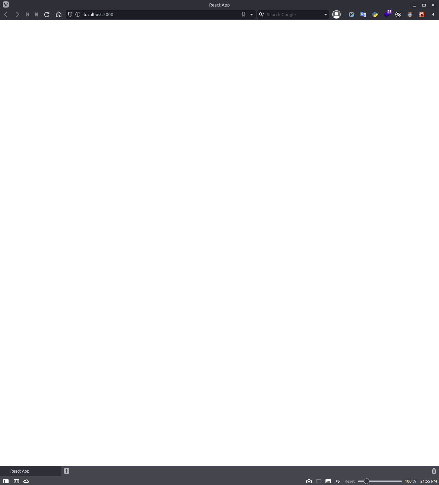

# This step
Simplify the created app

my-app created by cra has a rotating logo.

Let's remove this and make it a blank page.

# Change
## ./my-app/src/App.tsx
Change `./my-app/src/App.tsx` as following code.

```JSX
import React from 'react';

const App = () => {
  return (
    <>
    </>
  );
}

export default App;
```

# Remove
Please remove following files.

- `./my-app/src/App.css`
- `./my-app/src/logo.svg`

# Browser Screen
Year! my react app is blank page now.

