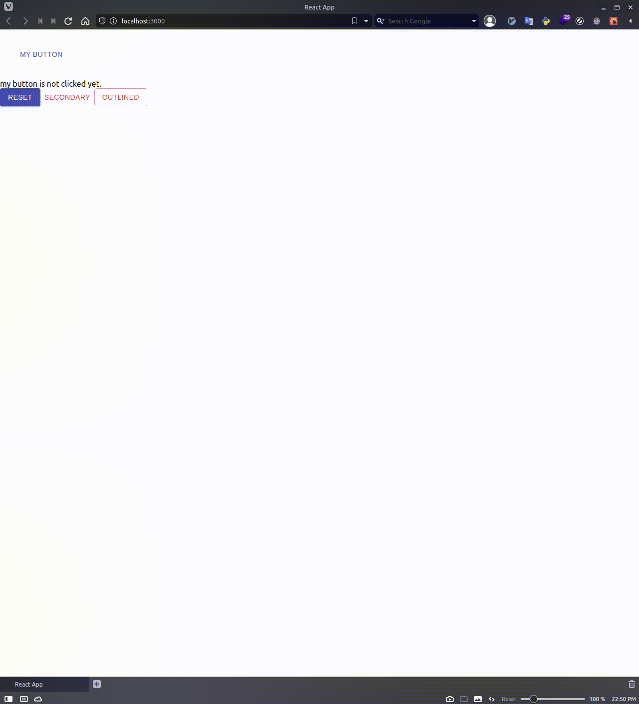

# This Step

install `material-ui` and put material-ui button on my-app.

# material-ui

by [official site](https://material-ui.com),

> React components for faster and easier web development.
> Build your own design system, or start with Material Design.

I write `material-ui` as `mui`.

# Command

Please run following command.

```bash
$ npm i @material-ui/core # `i` means `install` on npm command
```

# Change

## my-app/src/App.tsx

```JSX
import React, { useState } from 'react';
import { Button, Box } from '@material-ui/core';

const App = () => {
  const [clicked, setClicked] = useState<boolean>(false); // state in react component

  return (
    <>
      <Box m={2} p={2}>
        <Button color="primary" onClick={() => setClicked(true)}>
          My Button
        </Button>
      </Box>
      {clicked ? (
        <div>my button is clicked</div>
      ) : (
        <div>my button is not clicked yet.</div>
      )}
      <Button
        variant="contained"
        color="primary"
        onClick={() => setClicked(false)}
      >
        reset
      </Button>
      <Button color="secondary">secondary</Button>
      <Button variant="outlined" color="secondary">
        outlined
      </Button>
    </>
  );
};

export default App;
```

# Please check here

[official examples](https://material-ui.com/components/buttons/#button)

# Browser Screen



# Explanation

## import

import components named `Button`, `Box` from `@material-ui/core`.

```JSX
import { Button, Box } from '@material-ui/core';
```

## State in Component

following part is state in react function component.

- you can set `true` by calling `setClicked(true)`
- you can set `false` by calling `setClicked(false)`

```JSX
const [clicked, setClicked] = useState<boolean>(false);
```

## button with margin and padding

`m` in `<Box>` means margin and `p` means padding.

`onClick` in `<Button>` means action when clicked.

if `() => setClicked(true)` is called, change `clicked` to `true`.

```JSX
      <Box m={2} p={2}>
        <Button color="primary" onClick={() => setClicked(true)}>
          My Button
        </Button>
      </Box>
```

## Display status

if `clicked` is `true`, display the message `my button is clicked` ([reference of conditional ternary operator](https://developer.mozilla.org/en-US/docs/Web/JavaScript/Reference/Operators/Conditional_Operator)).

Otherwise, display the message `my button is not clicked yet.`.

```JSX
      {clicked ? (
        <div>my button is clicked</div>
      ) : (
        <div>my button is not clicked yet.</div>
      )}
```

## Reset Buttonn

if `() => setClicked(false)` is called, change `clicked` to `false`.

```JSX
      <Button
        variant="contained"
        color="primary"
        onClick={() => setClicked(false)}
      >
        reset
      </Button>
```

## Empty buttons

sample of buttons.

```JSX
      <Button color="secondary">secondary</Button>
      <Button variant="outlined" color="secondary">
        outlined
      </Button>
```

# Goal

You can use simple mui buttons.

let's go next step.
