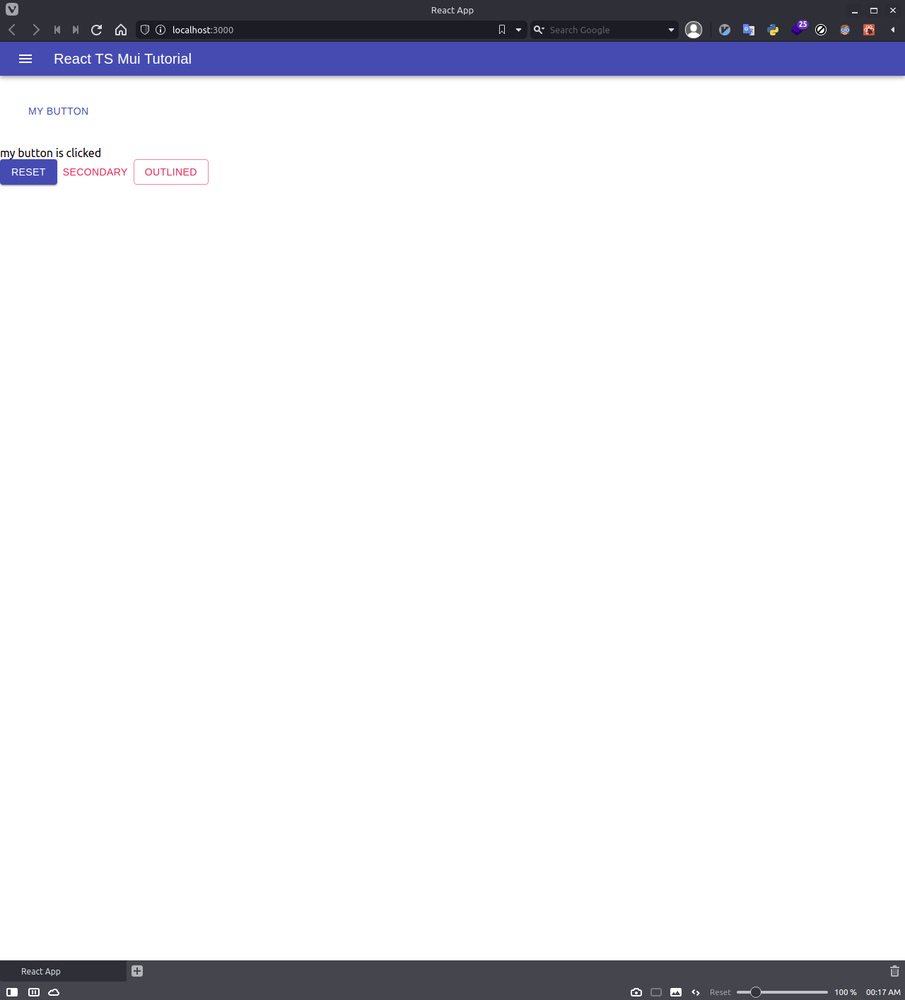

# This Step

Put simple App Bar on my-app.

# Command

```bash
$ npm install @material-ui/icons
```

# refference of App Bar

- [API](https://material-ui.com/api/app-bar/)
- [Examples](https://material-ui.com/components/app-bar/)

# Create

## ./my-app/src/components/NavBar.tsx

1. Create dir `./my-app/src/components/`
1. Create file `./my-app/src/components/NavBar.tsx`

```JSX
import React from 'react';
import { createStyles, makeStyles, Theme } from '@material-ui/core/styles';
import AppBar from '@material-ui/core/AppBar';
import Toolbar from '@material-ui/core/Toolbar';
import Typography from '@material-ui/core/Typography';
import IconButton from '@material-ui/core/IconButton';
import MenuIcon from '@material-ui/icons/Menu';

const useStyles = makeStyles((theme: Theme) =>
  createStyles({
    root: {
      flexGrow: 1,
    },
    menuButton: {
      marginRight: theme.spacing(2),
    },
  })
);

const NavBar = () => {
  const classes = useStyles();

  return (
    <div className={classes.root}>
      <AppBar position="static">
        <Toolbar variant="dense">
          <IconButton
            edge="start"
            className={classes.menuButton}
            color="inherit"
            aria-label="menu"
          >
            <MenuIcon />
          </IconButton>
          <Typography variant="h6" color="inherit">
            React TS Mui Tutorial
          </Typography>
        </Toolbar>
      </AppBar>
    </div>
  );
};

export default NavBar;
```

# Change

## ./my-app/src/App.tsx

1. add `import NavBar from './components/NavBar'`
1. add `<NavBar />`

```JSX
  import React, { useState } from 'react';
  import { Button, Box } from '@material-ui/core';
+ import NavBar from './components/NavBar';

  const App = () => {
    const [clicked, setClicked] = useState<boolean>(false);

    return (
      <>
+       <NavBar />
        <Box m={2} p={2}>
          <Button color="primary" onClick={() => setClicked(true)}>
            My Button
          </Button>
        </Box>
        {clicked ? (
          <div>my button is clicked</div>
        ) : (
          <div>my button is not clicked yet.</div>
        )}
        <Button
          variant="contained"
          color="primary"
          onClick={() => setClicked(false)}
        >
          reset
        </Button>
      </>
    );
  };

  export default App;
```

# Browser Screen


